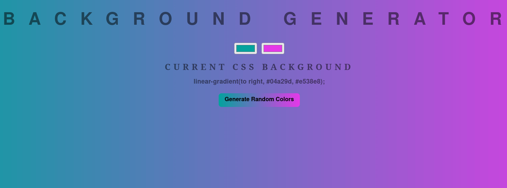

# Background Generator

A web application that allows you to easily generate custom backgrounds using gradients. 

## Features

- Customize the gradient by selecting colors.
- Generate a random background with the click of a button.
- See a live preview of the generated background.

## Demo

You can try out the [Background Generator app here](https://luriel-xyz.github.io/background-generator/).

## Installation

1. Clone the repository: `git clone https://github.com/luriel-xyz/background-generator.git`
2. Open `index.html` in your web browser.

## Usage

1. Select colors for the gradient by clicking on the color pickers.
2. See the live preview of the generated background.
3. Click the "Generate Random Colors" button to generate a random background.